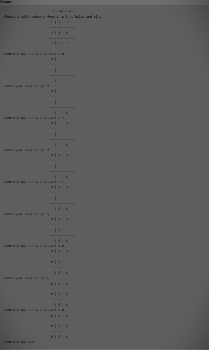

Here’s your complete and well-formatted **`README.md`** in GitHub markdown format, including the **output screenshot**, project description, features, compilation instructions, and more.

You can **directly copy and paste** this into your GitHub repository:

---

```markdown
# 🎮 Tic Tac Toe with AI (Minimax Algorithm)

This is a console-based **Tic Tac Toe** game built in **C language** where a human player competes against an unbeatable **AI opponent** powered by the **Minimax algorithm**.

<p align="center">
  
</p>

---

## 🧠 Features

- ✅ Fully playable 3x3 Tic Tac Toe board.
- 🤖 Smart computer moves using **Minimax Algorithm**.
- 👤 Human vs AI gameplay with turn-based interaction.
- 🧩 Move validation and winner/draw checking.
- 🖥️ Simple and clean text-based UI.

---

## 📌 Gameplay Snapshot

The board uses the following cell mapping for input:

```

## 1 | 2 | 3

## 4 | 5 | 6

7 | 8 | 9

```

- **Player** uses `X`
- **Computer** uses `O`
- The computer always makes the **first move**

🎯 **Goal:** Align three of your symbols (vertically, horizontally, or diagonally) before your opponent does.

---

## 🧠 Minimax Algorithm

The **Minimax algorithm** is used to evaluate all possible future states of the game and select the **optimal move** for the computer, ensuring the best chance of winning or at least drawing.

- AI always plays optimally.
- Human players need to block and plan ahead to avoid losing.

---

## 📂 Project Structure

```

.
├── tic\_tac\_toe.c      # Main C file with full game logic
├── output.png         # Game output screenshot
└── README.md          # Project documentation

````

---

## 🛠️ Getting Started

### 🔧 Requirements

- GCC or any C compiler
- Standard C libraries (`stdio.h`, `stdlib.h`, `stdbool.h`, `time.h`)

### 🧪 To Compile
```bash
gcc tic_tac_toe.c -o tictactoe
````

### ▶️ To Run

```bash
./tictactoe
```

---

## ✨ Highlights

* Modular code structure with functions like:

  * `showInstructions()`, `initialise()`, `gameOver()`
  * `findBestMove()` using Minimax
  * `evaluate()` for board scoring
* Handles invalid user input gracefully
* Clean output formatting for game board and results

---

## 📷 Output Screenshot

Below is an example output of the game played in the terminal:



---

## 📚 Ideal For

* 🧑‍💻 Beginners in **C programming**
* 🎮 Game development enthusiasts
* 🤖 Students learning **AI algorithms**
* 🧠 Practice in recursion and backtracking

---

## 🏁 Future Improvements (Optional Ideas)

* GUI-based version using SDL or C++
* Multiplayer mode (Human vs Human)
* Difficulty levels (Easy, Medium, Hard)
* Web version using WebAssembly

---

## 🧾 License

This project is licensed under the [MIT License](LICENSE).

---

## 🙌 Credits

Inspired by traditional paper-and-pen Tic Tac Toe and implementations of **AI in games** using **Minimax Algorithm**.

---

### 🔗 Connect

If you liked this project, give it a ⭐ on GitHub!

---

````

---

### 📌 What You Need to Do:

1. **Save the screenshot file** you uploaded as `output.png` inside the root of your GitHub repository.
2. Replace this line:
   ```markdown
   <img src="https://github.com/your-username/your-repo-name/blob/main/output.png" ...
````

with the **correct GitHub path** after pushing.

For example:

```markdown
<img src="https://github.com/kashish049/tic-tac-toe-minimax/blob/main/output.png" ...
```


